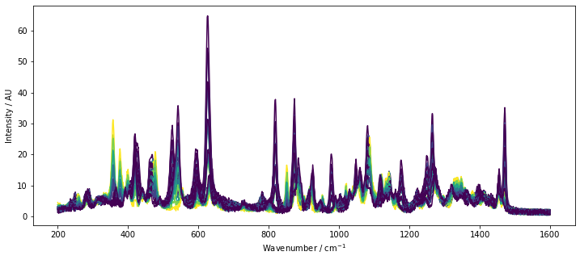

[](https://codecov.io/gh/maruedt/chemometrics)
[](https://chemometrics.readthedocs.io/en/latest/?badge=latest)

# chemometrics

**chemometrics** is a free and open source library for visualization, modeling, and prediction of multivariate data.

The package streamlines chemometric workflows by providing powerful preprocessing algorithms combined with simple
functional calls for generating fully calibrated chemometric models. A variety of analytical visualizations help to
understand the data and build trust into the generated models. Looking for further extending the models? chemometrics is
fully compatible with scikit-learn. Use advanced machine learning algorithms to get most out of your data.

The documentation is hosted at https://chemometrics.readthedocs.io

## Installation
chemometrics is distributed over PyPI. The simplest way to install chemometrics is by running

```
python -m pip install chemometrics
```

## Example applications

Plotting with reference coloring:
```python
import numpy as np
import matplotlib.pyplot as plt
import chemometrics as cm

plt.figure(figsize=[12, 5])
lines = cm.plot_colored_series(D.T, x=wavenumbers, reference=C[:, 1])
plt.xlabel(r'Wavenumber / $\mathrm{cm^{-1}}$')
plt.ylabel('Intensity / AU')
```



Preprocessing by smoothing and performing a second derivative:
```python
X_deriv = cm.Whittaker(constraint_order=3, deriv=2).fit_transform(X)
cm.plot_colored_series(X_deriv.T, reference=Y)
plt.xlabel('Wavenumber / nm')
plt.ylabel('$d^2A/dl^2$ / $mAU/nm^2$')
```


A working PLS model is just one function call away:
```python
cm.fit_pls(X_deriv, Y)
```


Interested in more? Check out following pages:
- [Full workflow](https://chemometrics.readthedocs.io/en/stable/examples/basic_pls_example.html)  from loading the data to interpreting the calibrated PLS model
- A variety of [examples](https://chemometrics.readthedocs.io/en/stable/examples.html)
- [Overview of the API](https://chemometrics.readthedocs.io/en/stable/api.html)


## Requirements
- Python >= 3.8
- NumPy >= 1.19.2
- SciPy >= 1.5.2
- scikit-learn >= 0.23.2
- matplotlib >= 3.3.2

Earlier versions of the required libraries may work but have not been tested.


## Copyright and license
chemometrics is released under GPLv3.

Copyright 2021, 2022 Matthias Rüdt
