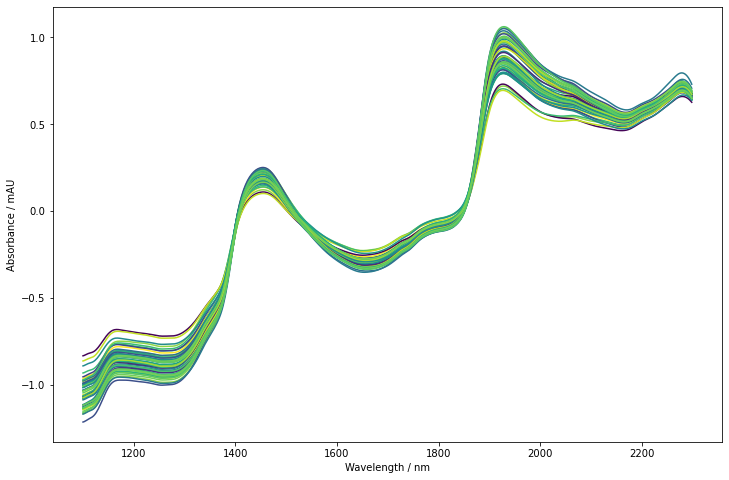
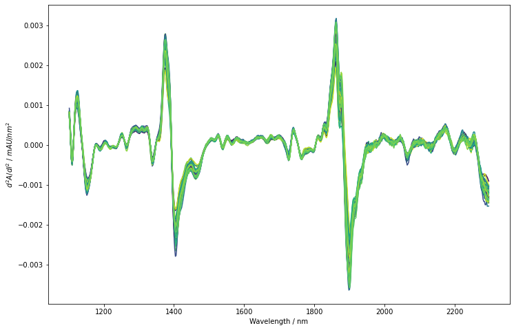
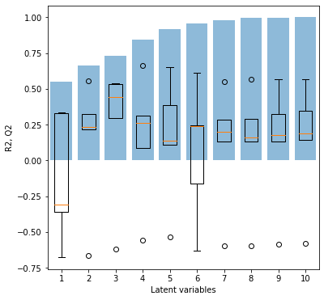
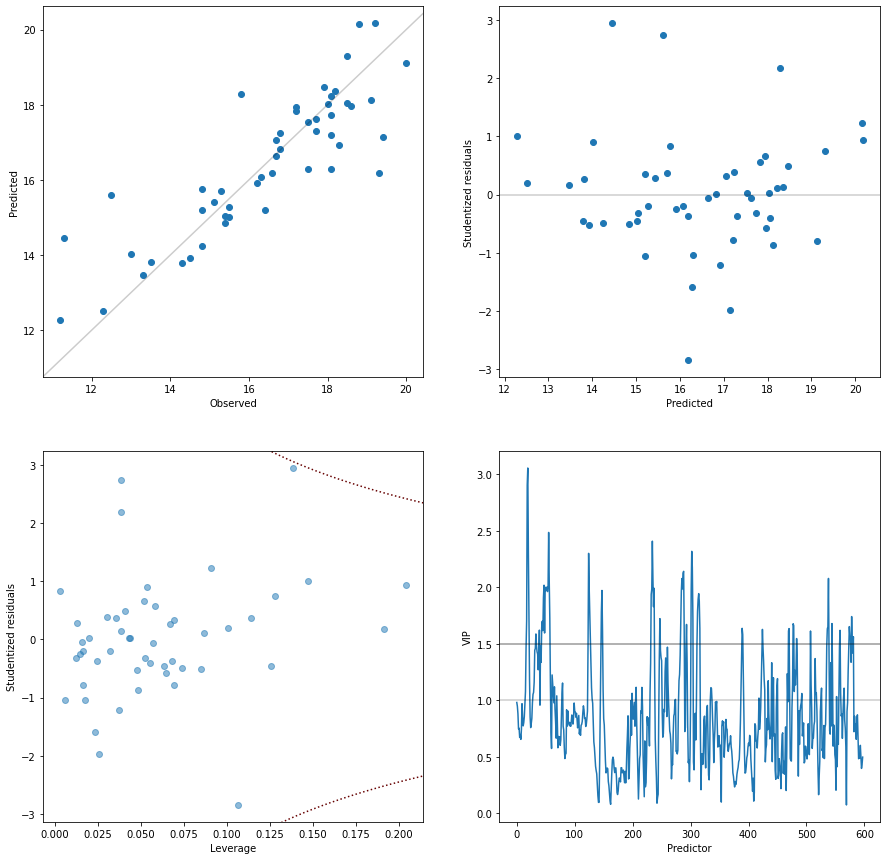

[](https://codecov.io/gh/maruedt/chemometrics)
[](https://chemometrics.readthedocs.io/en/latest/?badge=latest)

# chemometrics
chemometrics is a free and open source chemometric library for Python. Its main focus lies on the chemometric analysis of spectroscopic data (e.g. UV/Vis, NIR, Raman, NMR and MS). chemometrics builds on scikit-learn and extends its functionalities to support chemometric data analysis. The package provides methods for plotting, preprocessing and fitting data. In contrast to scikit-learn, chemometrics is mainly intended for interactive work.

chemometrics is work in progress. The current features are mainly revolving around the (supervised) analysis of spectroscopic data.

The documentation is available at https://chemometrics.readthedocs.io

## Example applications
Plotting:
```python
import matplotlib.pyplot as plt
import chemometrics as cm
cm.plot_colored_series(X.T, reference=Y)
plt.xlabel('Wavenumber / nm')
plt.ylabel('Absorbance / mAU')
```



Preprocessing:
```python
X_deriv = cm.Whittaker(constraint_order=3, deriv=2).fit_transform(X)
cm.plot_colored_series(X_deriv.T, reference=Y)
plt.xlabel('Wavenumber / nm')
plt.ylabel('$d^2A/dl^2$ / $mAU/nm^2$')
```



Regression:
```python
cm.fit_pls(X_deriv, Y)
```




## Requirements and installation
- Python >= 3.8
- NumPy >= 1.19.2
- SciPy >= 1.5.2
- scikit-learn >= 0.23.2
- matplotlib >= 3.3.2

Earlier versions of the required libraries may work but have not been tested.

chemometrics is distributed over PyPI. The simplest way to install chemometrics is by running

```
python -m pip install chemometrics
```


## Copyright and license
chemometrics is released under GPLv3.

Copyright 2021 Matthias Rüdt
